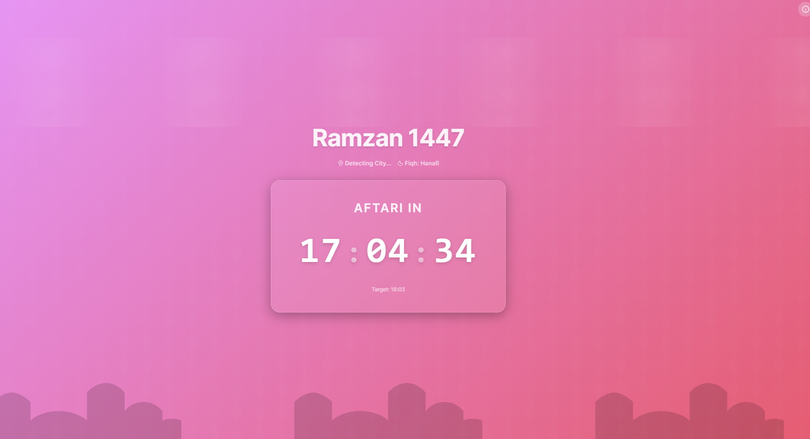

# 🌙 Ramzan Zenith (1447)

A premium, state-of-the-art Progressive Web App (PWA) designed to provide the most accurate and relaxing experience for your Ramzan journey. Featuring high-precision location detection, strict Fiqh-based calculations, and a majestic Islamic aesthetic.



## ✨ Key Features

- **🎯 Precision Timings**: Real-time prayer calculations using the Karachi method for Pakistan and global standards for other regions.
- **🛡️ Ihtiyat Safety Buffer**: 1-minute safety margin automatically applied to Sehri and Iftar times for peace of mind.
- **🏗️ Juristic Flexibility**: Toggle between **Hanafi** and **Jafri** Fiqh instantly.
- **🎨 Premium Islamic Theme**: Immersive HDR gradients, geometric "Girih" patterns, and thematic silhouettes (Moon/Mosque) that shift based on the time of day.
- **📅 30-Day Taqweem**: A comprehensive monthly prayer schedule at your fingertips.
- **🔊 Smart Audio Alerts**: Gentle, relaxing notification chimes that trigger automatically at Sehri and Iftar, with a robust online fallback.
- **📱 PWA Ready**: Install it as an app on your iOS or Android home screen. Works offline with high-accuracy GPS support.

## 🚀 Getting Started

### Prerequisites
- [Node.js](https://nodejs.org/) (Latest LTS recommended)
- [npm](https://www.npmjs.com/)

### Installation
1. Clone the repository:
   ```bash
   git clone https://github.com/yourusername/Ramzan-Compass.git
   cd ramzan-Compass
   ```

2. Install dependencies:
   ```bash
   npm install
   ```

3. Run locally:
   ```bash
   npm run dev
   ```

### 📦 Production Build
To create a optimized production build:
```bash
npm run build
```
The output will be in the `dist/` folder, ready for deployment.

## 🛠️ Tech Stack
- **Frontend**: React.js + Vite
- **Calculations**: [Adhan.js](https://github.com/batoulapps/adhan-js)
- **Icons**: Lucide React
- **Styling**: Vanilla CSS (Custom Glassmorphism)

## 🌐 Deployment
This project is optimized for **Vercel** or **Netlify**. Simply connect your GitHub repository and it will auto-deploy.

## 📜 License
MIT License - Created for the benefit of the community.
=======

### Installation
1. Clone the repository:
   ```bash
   git clone https://github.com/yourusername/Ramzan-Compass.git
   cd ramzan-zenith
   ```

2. Install dependencies:
   ```bash
   npm install
   ```

3. Run locally:
   ```bash
   npm run dev
   ```

### 📦 Production Build
To create a optimized production build:
```bash
npm run build
```
The output will be in the `dist/` folder, ready for deployment.

## 🛠️ Tech Stack
- **Frontend**: React.js + Vite
- **Calculations**: [Adhan.js](https://github.com/batoulapps/adhan-js)
- **Icons**: Lucide React
- **Styling**: Vanilla CSS (Custom Glassmorphism)

## 🌐 Deployment
This project is optimized for **Vercel** or **Netlify**. Simply connect your GitHub repository and it will auto-deploy.

## 📜 License
MIT License - Created for the benefit of the community.

